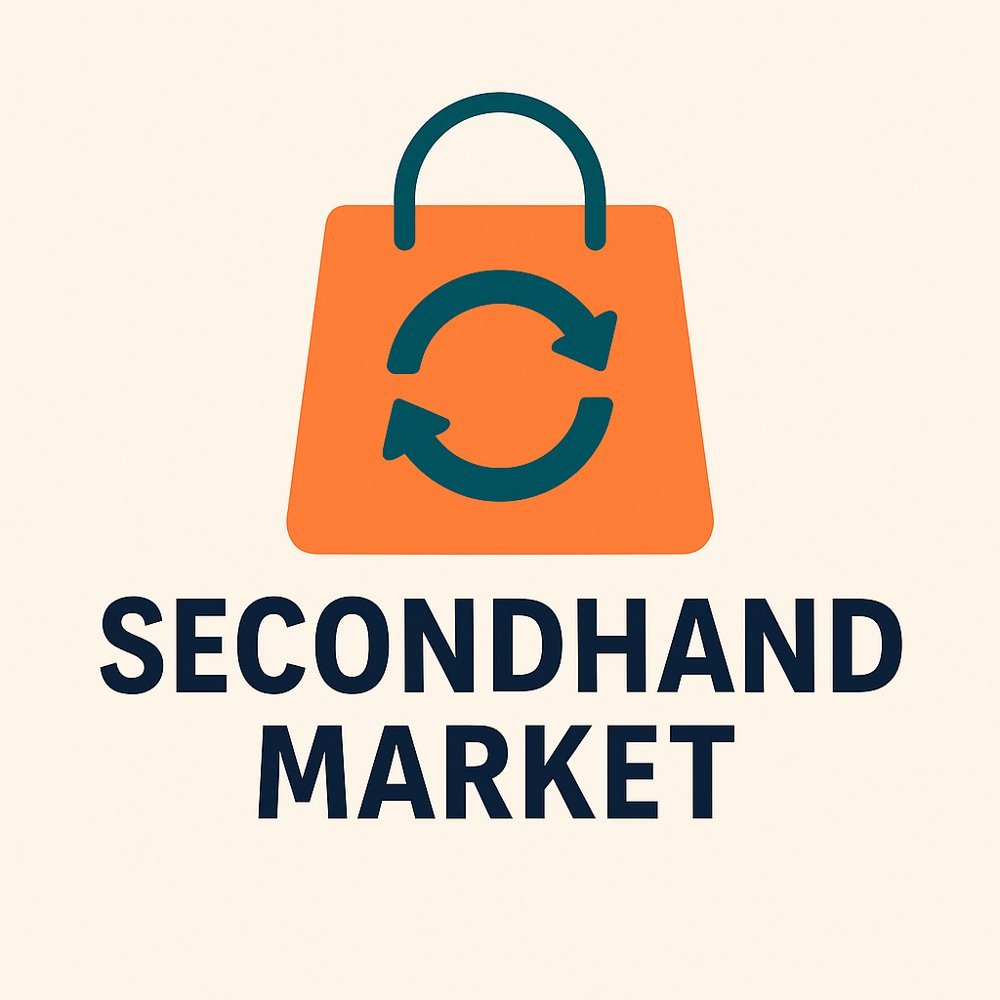

سامانه خرید و فروش کالای دست دوم - Secondhand Market

به دنیای نوآورانه خرید و فروش کالای دست دوم خوش آمدید!

این پروژه یک سامانه‌ی تحت وب است که با هدف ایجاد بستری ایمن، ساده و کارآمد برای مبادله کالاهای کارکرده طراحی شده است. کاربران می‌توانند در این سامانه کالاهای خود را برای فروش عرضه کرده یا کالاهای دیگران را جستجو، مشاهده و خریداری کنند.

چشم‌انداز (Vision)
در دنیای پرشتاب امروزی، نیاز به بازتوزیع منابع و استفاده‌ی بهینه از کالاها بیش از هر زمان دیگری احساس می‌شود. هدف ما از این سامانه، تسهیل خرید و فروش کالاهای دست دوم به شکلی هوشمند، شفاف و انسانی است.

ما می‌خواهیم بستری بسازیم که:
- کاربران به راحتی کالاهای خود را معرفی و عرضه کنند.
- خریداران با اطلاعات کامل، تجربه‌ای لذت‌بخش از انتخاب داشته باشند.
- تعامل و مذاکره میان افراد، با کمترین پیچیدگی و بیشترین امنیت انجام گیرد.
- چرخه‌ی مصرف مسئولانه‌تری در جامعه شکل گیرد.

✨ ویژگی‌های اصلی
- ثبت‌نام و مدیریت حساب کاربری برای فروشندگان و خریداران
- 📦 ثبت کالا همراه با عنوان، توضیحات، قیمت و تصویر
- 🔍 جستجو و فیلتر هوشمند بر اساس مشخصات کالا
- 💬 امکان ارتباط و مذاکره بین کاربران
- 📊 تعیین وضعیت معامله‌ی کالا: فعال، فروخته شده، رزرو شده
- 🚨 سیستم گزارش تخلف و بررسی توسط مدیر سامانه
- 🛠 امکانات مدیریتی برای کنترل تخلفات، کاربران و کالاها

اهداف پروژه
- ارائه بستری امن برای مبادله کالاهای کارکرده  
- کاهش هدررفت منابع با ترویج فرهنگ استفاده مجدد  
- افزایش اعتماد میان کاربران با فراهم‌سازی امکان تعامل مستقیم  
- ساخت تجربه‌ای روان و حرفه‌ای برای کاربران ایرانی

🗂 لینک‌های مرتبط

🔗 برد مدیریت پروژه (Project Board):

[GitHub Projects - مدیریت وظایف](https://github.com/users/alireza-zare2553/projects/3)

وضعیت فعلی توسعه

تعریف نیازمندی‌ها : انجام شده 

ساخت برد پروژه : انجام شده

ایجاد و ثبت مسائل (Issues):انجام شده

طراحی رابط کاربری اولیه : در حال برنامه‌ریزی

پیاده‌سازی بک‌اند و پایگاه داده : در انتظار شروع

توسعه امکانات ثبت، جستجو و مذاکره:در انتظار شروع

تست، دیباگ و انتشار نسخه اولیه:آینده نزدیک 

🛠 تکنولوژی‌های پیشنهادی

- Backend: Python (Django یا Flask)
- Frontend: HTML, CSS, JavaScript 
- Database: SQLite یا PostgreSQL
- DevOps: Git, GitHub, GitHub Projects
- مدیریت پروژه: Issues + Project Board

با ما همراه شوید
اگر به توسعه پروژه‌های کاربردی علاقه‌مندید، یا پیشنهادی برای بهبود دارید، خوشحال می‌شویم که مشارکت کنید یا فیدبک بدهید.

با هم، خرید و فروش هوشمند، امن و انسانی‌تری بسازیم. 🌍
